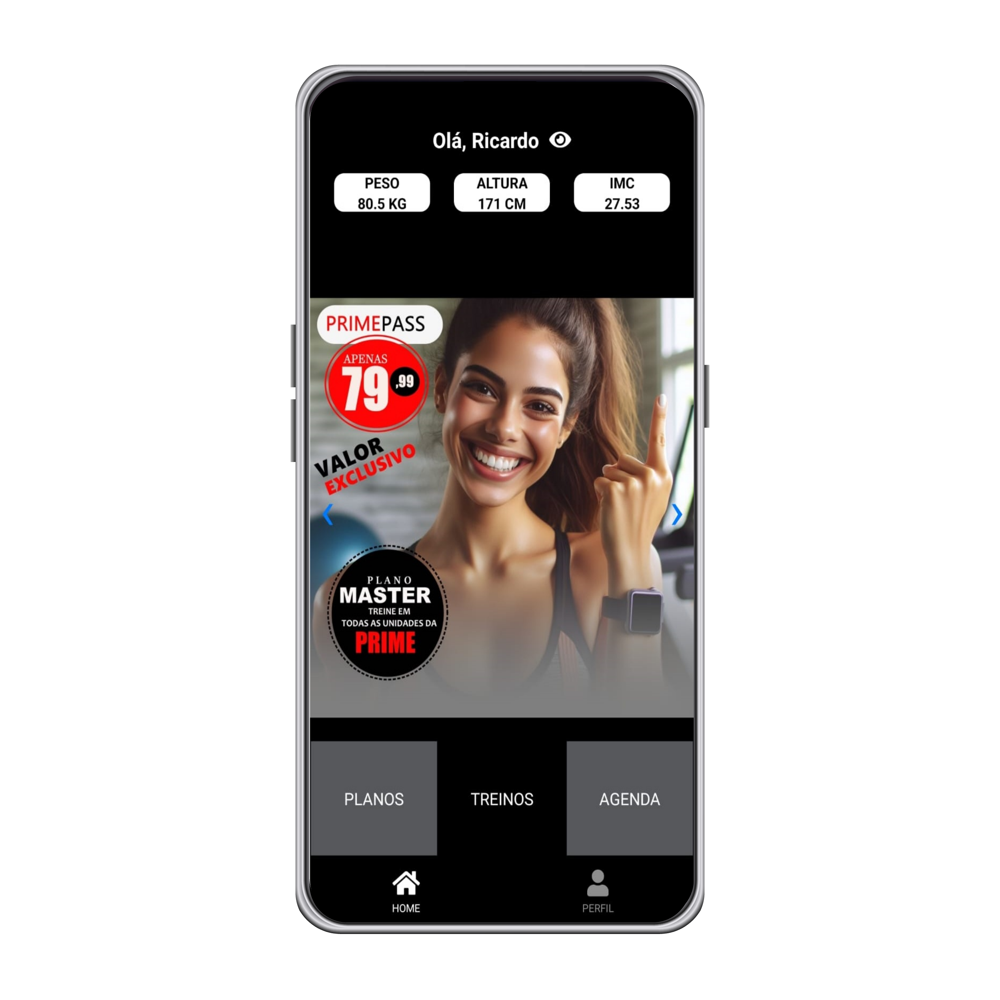
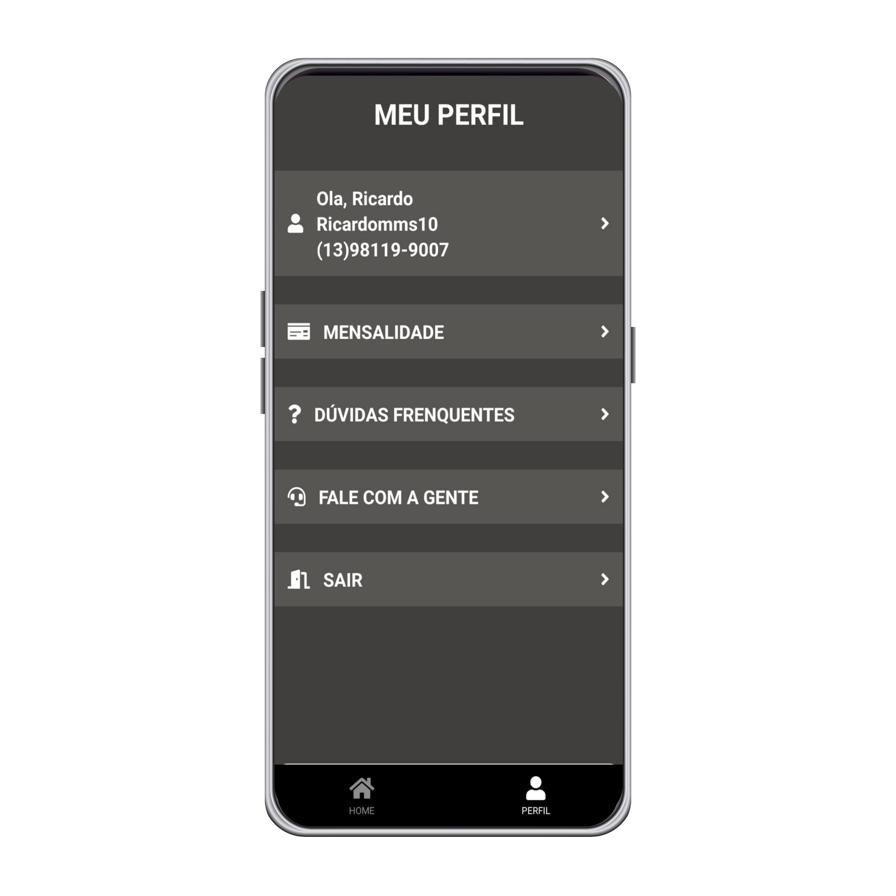

# Academia Prime - Aplicativo de Fitness

<div style="display: flex;">
    
    
   
</div>

# Projeto Pessoal em React Native

O **Academia Prime** é um projeto pessoal que desenvolvi para colocar em prática meus conhecimentos em React Native. Como entusiasta do fitness e desenvolvedor, percebi a necessidade de um aplicativo que facilitasse a gestão de treinos, acompanhasse o progresso dos alunos e gerenciasse as mensalidades de uma academia.

Desenvolver o Academia Prime não apenas me permitiu aplicar conceitos teóricos de programação, como também me desafiou a resolver problemas do mundo real, como a criação de interfaces intuitivas e ter facilidade nos treinos.

Ao longo do processo de desenvolvimento, pude aprimorar minhas habilidades em React Native, JavaScript, gerenciamento de estado com Redux, integração de bibliotecas de terceiros e resolução de bugs. Além disso, aprendi a importância de uma boa arquitetura de software e boas práticas de codificação para garantir um código limpo, modular e escalável.

Embora o Academia Prime seja um projeto pessoal, estou aberto a feedbacks e contribuições da comunidade. Acredito que a colaboração e o compartilhamento de conhecimento são fundamentais para o crescimento profissional e o desenvolvimento de soluções ainda melhores.

Sinta-se à vontade para explorar o código-fonte do Academia Prime, sugerir melhorias ou até mesmo contribuir com novos recursos. Estou ansioso para ver como esse projeto pode evoluir e ajudar a comunidade fitness a atingir seus objetivos de forma mais eficaz e eficiente.

## Tecnologias Utilizadas

- React Native
- JavaScript
- Bibliotecas de terceiros 
- Git 
- E muitas outras ferramentas e bibliotecas úteis para o desenvolvimento de aplicativos móveis.


O **Academia Prime** é um aplicativo móvel projetado para fornecer aos alunos uma experiência completa na palma da mão, oferecendo uma variedade de recursos relacionados ao fitness, treinamento, agenda e mensalidades. Este README fornece uma visão geral do aplicativo, incluindo instruções de instalação, recursos principais e formas de contribuição.

# Recursos Principais

O **Academia Prime** oferece uma série de recursos para melhorar a experiência dos alunos e ajudá-los a atingir seus objetivos de fitness de forma eficaz. Alguns dos recursos principais incluem:

1. **Treinos Personalizados**: Os alunos têm acesso a uma variedade de treinos personalizados adaptados às suas necessidades e objetivos individuais. O aplicativo fornece uma biblioteca de exercícios.

2. **Agenda de Aulas**: Os alunos podem visualizar a agenda de aulas oferecidas pela academia. Isso ajuda a manter os alunos organizados e comprometidos com suas rotinas de exercícios.

3. **Gestão de Mensalidades**: Os alunos podem gerenciar suas mensalidades diretamente pelo aplicativo, verificando seu status de pagamento, visualizando históricos de transações.


# Como Abrir o Projeto

Para abrir e executar o código-fonte do projeto **Academia Prime**, siga estas etapas:

## Pré-requisitos

Antes de começar, certifique-se de ter o seguinte instalado em sua máquina:

- Node.js
- npm (Node Package Manager) ou yarn
- Um editor de código, como Visual Studio Code, Sublime Text ou Atom

## Clonando o Repositório

1. Abra o terminal ou prompt de comando.
2. Navegue até o diretório onde você deseja clonar o repositório do Academia Prime.
3. Execute o seguinte comando para clonar o repositório:

```bash
git clone https://github.com/Ricardomms10/AppAcademia
cd academia-prime
npm install
ou
yarn install
npx react-native run-android
npx react-native run-ios
```

# Autor

Ricardo Malta

Ricardomms10@gmail.com
